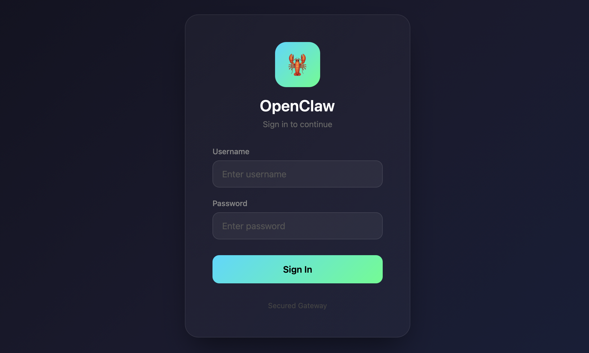
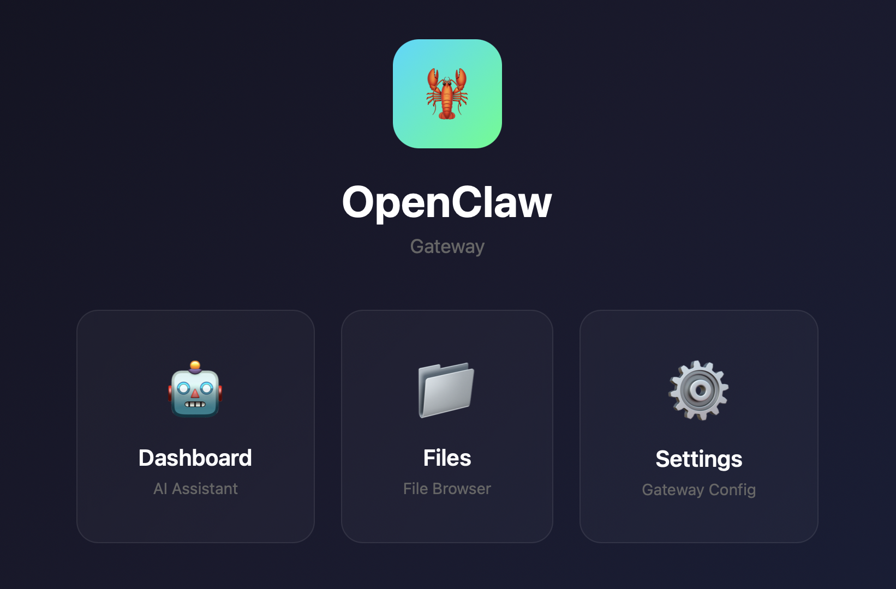
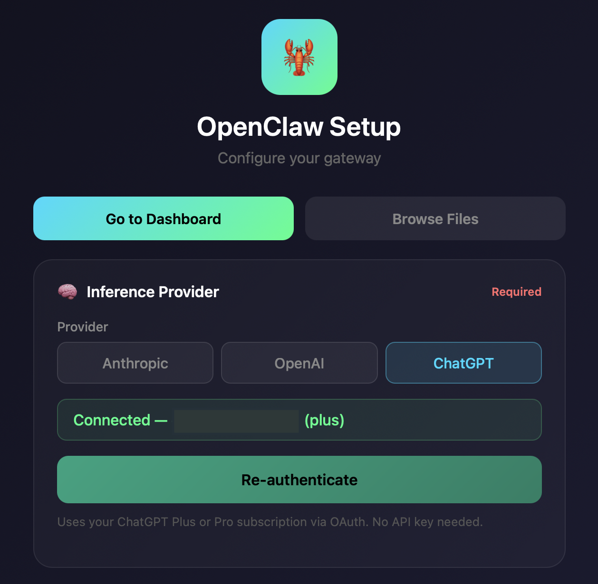
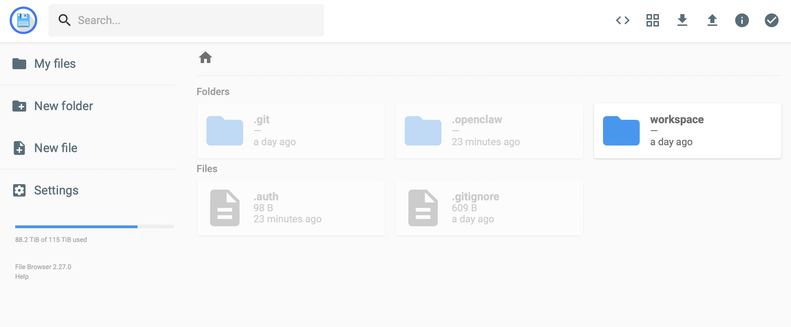

# OpenClaw Secure Shell

OpenClaw Secure Shell is a Docker package that gives you a fully working OpenClaw instance with a built-in setup utility and login protection. You deploy it, open the URL, select an inference provider, set the password, and your instance is ready to use.

This does not limit your OpenClaw instance in any way. You get full access to a standard OpenClaw installation - the shell just adds a layer on top that makes it password-protected and easier to get started with. No terminal access or manual config file editing required to get up and running.

---

## What's included

After deployment, your instance comes with four main screens - all accessible from a navigation page you land on after login.

### Login page



Your instance is protected from the moment of deployment. No one can access anything without providing a username and password. On first launch, the default credentials are `admin` / `admin` - the setup page prompts you to change these immediately.

### Navigation page



After logging in, you land on a navigation page with buttons for **Dashboard**, **Files**, and **Setup** - so you can quickly get to any part of your instance.

### Setup page (login-protected)



A web-based setup utility that lets you bootstrap your instance so it becomes usable. At its minimum, all you need is to change the password and provide an inference provider - after that, your instance can talk to you and you can configure everything else by chatting with it. Additionally, the setup page offers a few optional integrations for convenience:

**Required:**

- **Username & password** - replace the default `admin/admin` credentials
- **Inference provider** - connect one of the supported AI providers to power your instance:
  - **ChatGPT subscription** - use your existing ChatGPT Plus/Pro subscription via the OpenAI-compatible API
  - **OpenAI API** - connect with an OpenAI API key
  - **Anthropic API** - connect with an Anthropic API key

**Optional:**

- **Telegram bot token + user ID** - connect a Telegram bot so you can message your OpenClaw instance directly from Telegram. Once configured, the bot is immediately functional - just send it a message
- **Deepgram API key** - enables voice messages, so you can speak with your instance instead of just typing
- **Brave Search API key** - gives your instance web search capability

Cron is activated and configured automatically during setup.

After saving your settings, click **Go to Dashboard** and your instance is fully operational.

### OpenClaw dashboard (login-protected)

<!-- No screenshot available yet -->

The native OpenClaw dashboard, accessible at `/dashboard`. This is the standard OpenClaw interface where you interact with your instance - chat, manage skills, configure channels, and everything else OpenClaw offers. The dashboard is the same as what you'd get with a standalone OpenClaw installation, just wrapped behind the login protection that OpenClaw Shell provides.

### File browser (login-protected)



A web-based file manager accessible at `/files/`. Browse, upload, download, and edit files in your `/data` volume directly from the browser. Useful for inspecting workspace files, managing skills, or editing configuration without needing terminal access.

---

## Features

OpenClaw Shell provides these persistent capabilities:

### Authentication gateway

All access to your instance goes through a password-protected auth layer. The login page, dashboard, file browser, setup page, and private pages all require authentication. This is always active and cannot be bypassed.

### Public pages

Your instance can create and serve publicly accessible web content at `/pages/`. Ask your OpenClaw instance to create landing pages, forms, or dashboards - they'll be available to anyone without login. Files are stored in `/data/workspace/pages/`. A backend API is available at `/pages-api/` for server-side logic.

### Private pages

Auth-protected pages and tools at `/app/`. Same as public pages but require login to access. Files are stored in `/data/workspace/app/`. Backend API available at `/app-api/` with authentication context, so your private pages can build features that know who's logged in.

### Headless Chrome browser

Pre-installed Chromium for web scraping and browser automation. Your OpenClaw instance can visit and analyze JavaScript-heavy pages, take screenshots, and extract data from dynamic content - all without needing to install anything extra.

### Git backups

Automated backup of your workspace and configuration to a private GitHub repository. Once configured, your instance pushes snapshots on a schedule you choose (daily, hourly, weekly, or custom). See [GitHub backup setup](#github-backup-setup) for instructions.

### Pre-configured cron

Cron is set up and enabled out of the box. Your OpenClaw instance can schedule reminders, recurring tasks, and other time-based operations without any additional configuration.

---

## Deploy

This project is primarily built for and tested on [Railway](https://railway.com?referralCode=2L3MjM) (referral link - gives us both credits). However, it works on **any platform that can deploy from a Dockerfile and provision a public URL** - Coolify, Render, fly.io, or a plain VPS with Docker.

### Railway (recommended)

1. Create a new project in Railway, select **Deploy from GitHub Repo**, and paste this repository URL
2. Add a volume mounted at `/data`
3. Set environment variable: `RAILWAY_RUN_UID="0"` (Railway runs containers as non-root by default, which breaks volume write permissions - this overrides that)
4. Click **Deploy**
5. Go to **Settings → Networking → Public Networking**, generate a domain on port **8080**
6. Open your public URL

### Other platforms

1. Deploy this repository (or build the Dockerfile)
2. Mount a persistent volume at `/data`
3. Expose port **8080** with a public URL
4. Open your public URL

---

## First-run setup

When you open your instance for the first time, log in with the default credentials:

- Username: `admin`
- Password: `admin`

You'll be redirected to the **Setup page** where you configure:

| Field | Required? | Description |
|-------|-----------|-------------|
| **Username & Password** | Yes | Replace the default `admin/admin` immediately |
| **Inference Provider** | Yes | ChatGPT subscription, OpenAI API key, or Anthropic API key |
| **Telegram Bot Token + User ID** | Optional | Connect a Telegram bot. Token from [@BotFather](https://t.me/BotFather), ID from [@userinfobot](https://t.me/userinfobot) |
| **Deepgram API Key** | Optional | Voice message support. [console.deepgram.com](https://console.deepgram.com) |
| **Brave Search API Key** | Optional | Web search capability. [brave.com/search/api](https://brave.com/search/api) |

Click **Save Settings**, then **Go to Dashboard**. Your OpenClaw instance is ready.

> **Important:** Change the default password immediately. Anyone who discovers your URL can access your instance with `admin/admin` until you do.

---

## Pages overview

| Page | Path | Description |
|------|------|-------------|
| **Login** | `/` | Password-protected entry point |
| **Navigation** | `/` (after login) | Buttons for Dashboard, Files, and Setup |
| **Setup** | `/setup` | Credentials, API keys, and integration configuration |
| **Dashboard** | `/dashboard` | Native OpenClaw dashboard |
| **Files** | `/files/` | Web-based file browser for `/data` |
| **Public Pages** | `/pages/` | Publicly accessible content (no auth required) |
| **Private Pages** | `/app/` | Auth-protected pages and tools |

---

## GitHub backup setup

Set up automated git backups to preserve your workspace and configuration.

### Step 1: Create a private GitHub repo

1. Go to [github.com/new](https://github.com/new)
2. Create a **private** repository (e.g., `openclaw-backup`)
3. Do not add README, .gitignore, or license
4. Copy the SSH URL: `git@github.com:YOUR_USERNAME/REPO_NAME.git`

### Step 2: Ask your OpenClaw instance to set it up

Just tell your instance in the chat:

```
You: Set up GitHub backup. Repo: git@github.com:YOUR_USERNAME/REPO_NAME.git

OpenClaw: I'll generate SSH keys...
          Here's your public key:
          ssh-ed25519 AAAAC3NzaC1lZDI1NTE5AAAA... deploy-key
          Add this as a deploy key to your GitHub repo.
```

### Step 3: Add deploy key to GitHub

1. Repository → **Settings** → **Deploy keys** → **Add deploy key**
2. Paste the public key, check **"Allow write access"**
3. Tell your instance the key is added, and set your backup frequency (daily, hourly, weekly, or custom)

### What gets backed up

All of the OpenClaw identity and user data is backed up.

**Excluded:** secrets, API keys, credentials, browser profiles, session data.

---

## Technical reference

### File locations

All paths below are relative to `/data`, which is expected to be a persistent volume mounted into the container. It is important to have this volume mounted - otherwise all data will be lost when the instance is updated or restarted.

| Path | Description |
|------|-------------|
| `/data/.openclaw/` | OpenClaw configuration & state |
| `/data/.openclaw/openclaw.json` | Main config (API keys, gateway token, channels) |
| `/data/workspace/` | Agent workspace (skills, pages, files) |
| `/data/.auth` | Auth-proxy credentials (survives redeployments) |
| `/data/.env` | Platform-managed env vars |
